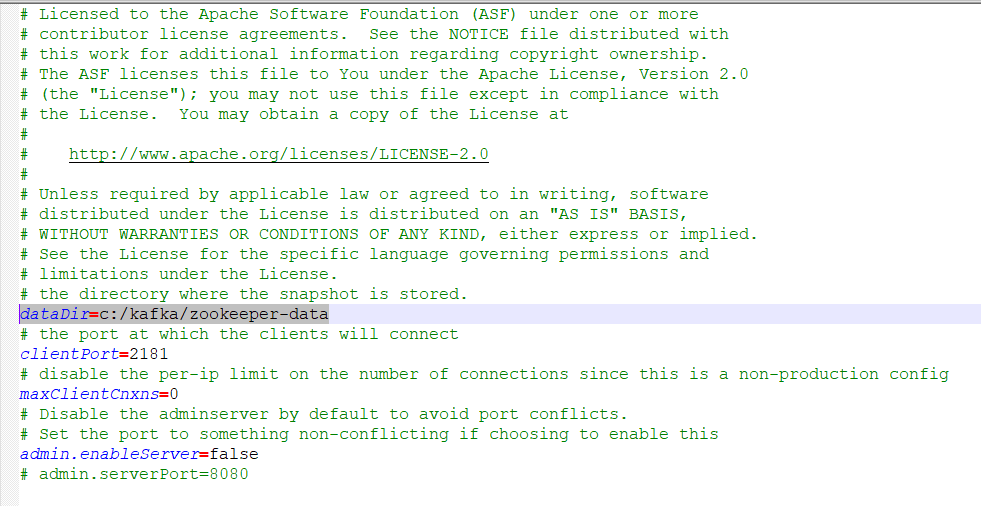
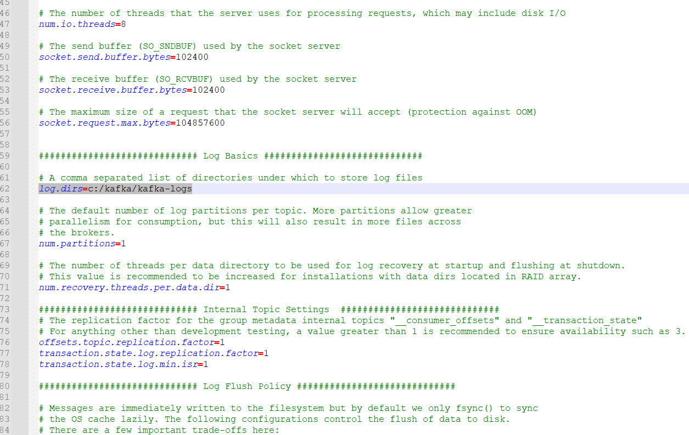
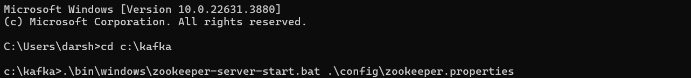
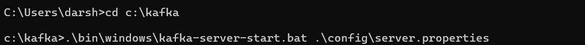
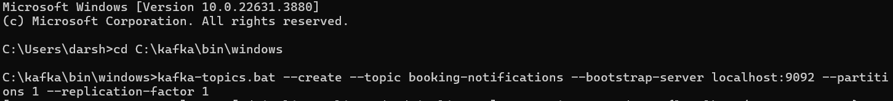
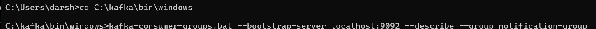

# CO2-lab-booking-app-backend
Software engineering course - team project

## technology
- Spring Boot

## Micro-services
- user-service          : 8084
- inventory-service     : 8085
- configuration-service : 8086
- booking-service       : 8087
- notification-service  : 8088
- [Notification Service Configuration](#kafka-configuration)

## API Gateways
- Admin-API-Gateway : 8080

## Discovery-server
- Eureka : 8761

## Distributed Tracing
- zipkin : 9411

## Kafka Configuration

Follow these steps to configure Kafka:

1. **Download Kafka**
  - [Download link](https://downloads.apache.org/kafka/3.7.1/kafka_2.13-3.7.1.tgz)
  - Unzip the file in the `C` drive and rename the folder to `Kafka`.

2. **Setup Log Directories**
  - Open `C:\kafka\config\zookeeper.properties` and change `dataDir` to `c:/kafka/zookeeper-data`.
    ```properties
    dataDir=c:/kafka/zookeeper-data
    ```
    
  - Open `C:\kafka\config\server.properties` and change `log.dirs` to `c:/kafka/kafka-logs`.
    ```properties
    log.dirs=c:/kafka/kafka-logs
    ```
    

3. **Start ZooKeeper Server**
  - Open Command Prompt in the Kafka directory and run:
    ```
    .\bin\windows\zookeeper-server-start.bat .\config\zookeeper.properties
    ```
    

4. **Start Kafka Broker**
  - Open a new Command Prompt in the Kafka directory and run:
    ```
    .\bin\windows\kafka-server-start.bat .\config\server.properties
    ```
    

5. **Create Kafka Topic**
  - Open a new Command Prompt in `C:\kafka\bin\windows` directory and run:
    ```
    .\kafka-topics.bat --create --topic booking-notifications --bootstrap-server localhost:9092 --partitions 1 --replication-factor 1
    ```
    

6. **Describe Kafka Consumer Group**
  - Open a new Command Prompt in `C:\kafka\bin\windows` directory and run:
    ```
    .\kafka-consumer-groups.bat --bootstrap-server localhost:9092 --describe --group notification-group
    ```
    

